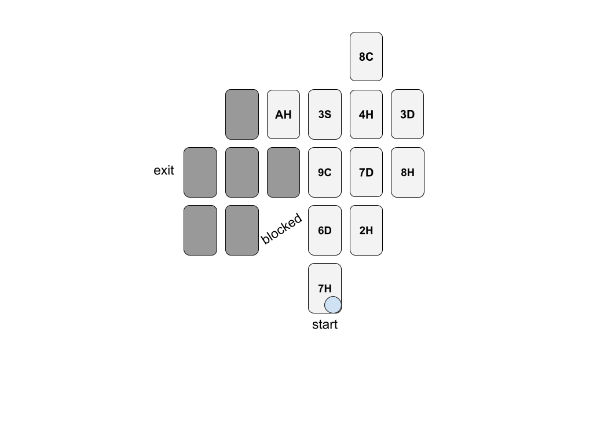

## Space Layout

To begin a new space (or "room" or whatever for interior quests) start by shuffling the Room deck, then flipping over the top two cards (3 cards for 4+ players). Add the card values together - this determines the number of "spots" in the room (each spot is a card and represents a small area of the space). If this is an interior quest, flip another card to determine if the room is lit or not: red means it is lit, black means the room is pitch black. If this is an exterior quest the space is lit during the day and dark at night. Refer to the [Setting up a Session](03_setting_up_a_session.md) section for guidance on interior versus exterior quests (and be sure to keep track of your day/night cycle).

Now lay the determined number of cards face down on the table from the Room, beginning in front of your player pieces. The first card you lay down will be where your characters will enter the space. You can configure the spots in any pattern you like, but they must all be connected (no diagonal connections, and no "islands"). All of the cards should be oriented in the same manner (portrait or landscape), and should be laid out so the edges all match. In other words, you cannot put a card half way between two other cards. Look at the example layouts below to see what this looks like.

You should rotate which player lays out each room. While this can be a discussion and group activity, that person gets the final say!

### Determining the Exit

The exit for any room is determined by first flipping another card from your Room deck: a 2-4 indicates the exit is to the left of the starting side, a 5-7 indicates it is across from the starting side, and an 8-10 indicates it is to the right of the starting side. The actual exit spot (think: where the door is) will be the furthest card away from the starting spot – or furthest to the left of the start if the exit is across from the entrance.

If you flip an Ace the exit is barricaded and you must defeat all enemies in the room before the exit will open (at which point you may exit that way and proceed as usual). This means you must reveal the entire room before the exit will open.

> Note that you may want to mark the entrance and exit in each room with some marker.

### Example Layouts

Here are two possible layouts for reference:

| Example 1 | Example 2 |
| --------- | --------- |
| Dark room; exit card flip was a 3 | All spots revealed; exit card flip was a 7 |
|  |  |

> Note that the layout does not need to be symmetrical, but all cards must be connected!

### Revealing the Room

If the space is lit, characters can see farther into the area. If the space is not lit, then it is pitch black, and characters can only see the spots directly around them.

When a [player moves](06_player_turns.md#player-movement) to a new spot (whether stopping or not), they will always be able to see that spot, so you should turn the layout card over to reveal what is there if not already revealed. If the space is lit, then when a new spot is revealed, any spot in that character's [line of sight](06_player_turns.md#line-of-sight) is also revealed. This includes diagonal spots.

If the space is dark, then when a new spot is revealed, only the spot that character is on and spots one move away are revealed. This **does not include diagonal spots** since players cannot move diagonally.

Below are two examples, one in a lit room, one in a dark room. They both start from the same layout.

|  |  |
| ------------------- | --- |
| **Starting Layout** |  |
| **Lit Room Example** |  |
| Upon entering... | After moving up 1 spot... |
|  |  |
| **Dark Room Example** |  |
| Upon entering... | After moving up 1 spot... |
|  |  |

> Note that "blocked" spots stop your line of sight!

#### Determining what is on a spot

Any time a spot is revealed you need to determine what each spot is or contains. Use the default space layout values table below - or your scenario-specific table - to find the card and then take the appropriate action.

**For enemy spots**, turn over the top card from the Enemy deck and place it on the spot. Remember that the enemy may be able to move, so do not replace the card on that spot, but instead place the enemy card on top of the spot. You may want to record the enemy in your [Session Log](guides/P52-session-log.pdf). See the Enemies table for more information.

For multi-enemy spots, use the same directions as above, but flip over multiple enemy cards. They will all start on the same spot, but may move differently. If you are in danger of running out of enemy cards, place any multi-enemy spots first. If you do run out of enemy cards then there are no more enemies in that room ... lucky you!

**For item chests** you do not need to do anything special, but remember that the chest can only be opened once, thus after the item is retrieved - or destroyed - the spot is simply empty. You may want to mark unopened chests with a marker!

Lastly, note that any spot not taken up by a card (that is, anywhere that you have not placed a card in the layout) is considered **impenetrable** and visually impairing. In other words, you can't see through those spots and you can't attack through those spots (even ranged attackers). In the example layouts above the "blocked" spots are examples of this.

> Note that enemies on the other side of a "blocked" spot still know you are there, and will still move to get you. The [Enemy Turns](08_enemy_turns.md) section will discuss that in more detail.

### Space Layout Default Values

When revealing any spot in the space, use the table below to determine what lies on that spot. These are default values - check your scenario for any deviations!

All **Aces, twos, and threes** are always specific to your particular scenario and quest!

| Card # | Suit | Effect |
| ------ | ---- | ------ |
|    4   | ♡♢♤♧ | Empty |
|    5   | ♡♢♤♧ | Obstructed † |
|    6   | ♡♢♤♧ | Hidden Spot * |
|    7   | ♡♢♤♧ | Chest |
|    8   | ♡♢   | Enemy |
|    8   | ♤♧   | Trap ‡ |
|    9   | ♡♢   | Enemy |
|    9   | ♤♧   | Chest |
|   10   | ♡♢   | <4 players: Obstructed; 4+ players: Double Enemy |
|   10   | ♧    | Secret Passage ^ |
|   10   | ♤    | Enemy |

> \* When on **Hidden** spots, an enemy can only see you if they are also on the spot (thus no ranged attacks). Ranged attacks made _from_ this spot (by a player or enemy) cannot be countered, but can be defended.
>   
> † When traveling through an **Obstructed** spot a player or enemy must use **2 movement actions**. For players or enemies with a movement of 1, this spot takes two turns.
>   
> ‡ Any time a player moves onto a spot with a **Trap**, they must flip to avoid the effects (damage). If they flip lower than their target, they take 2 damage (cannot be defended). The target is: `13 - (Balance + Move)`  
> Note that triggering a trap does not disable it. Thus any other players must also perform this check. Enemies are immune to the traps.
>   
> ^ A **Secret Passage** can transport a player from this spot to any spot of the **same suit** using **2 movement actions**. The passage is one way, and enemies may not use these passages.

Next > [6. Player Turns](06_player_turns.md)
