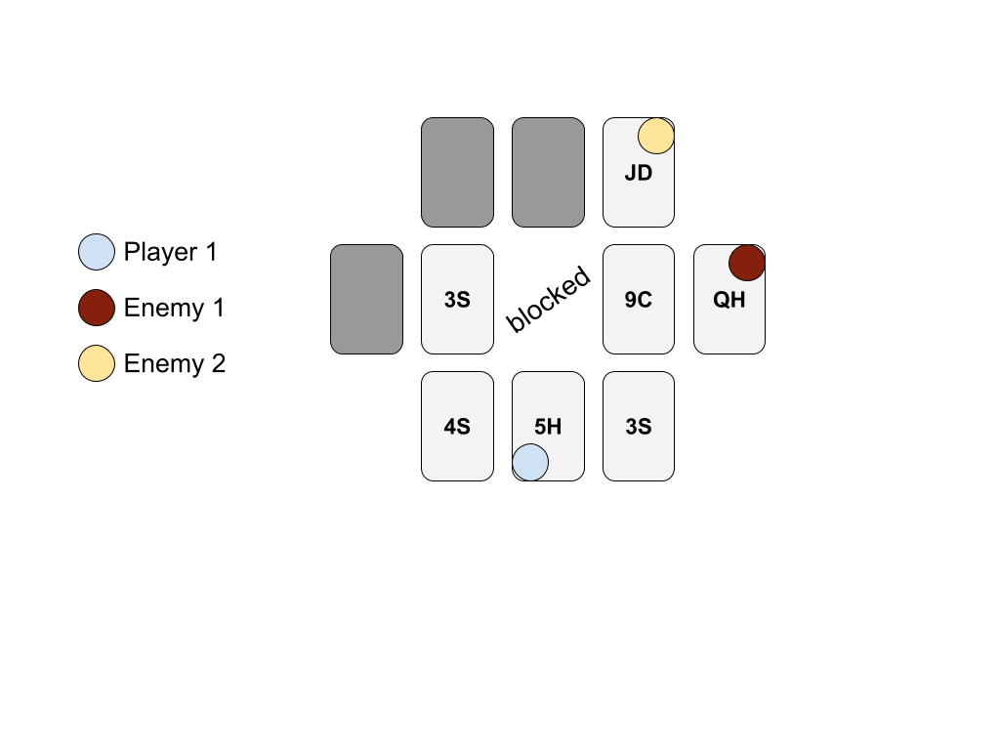
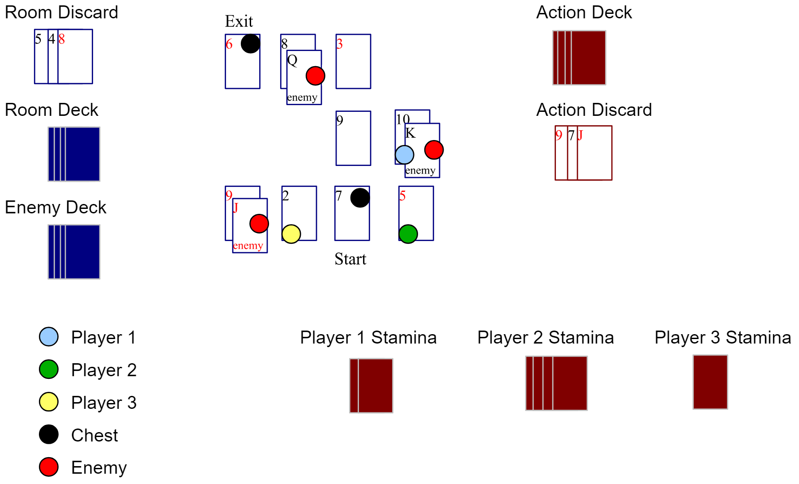

## Player Turns

### Entering a Space

Once the [layout of the space](05_space_layout.md) is complete, move your entire party onto the starting spot (the first card you laid down) and reveal it. While you do not all have to move together, you all must start together in any space.

After entering the space, be sure to reveal any spots you can all see based on whether the room is lit or not (and any special abilities).

### Initiative

Each player should already know their initiative level from [creating their character](02_creating_a_character.md) and it should be recorded on their [character sheet](guides/P52-character-sheet.pdf). (Note that your initiative level can change over time as your abilities increase.)

If there are any immediately visible enemies when you enter the space, **flip a card from your Action deck** to see if either party gets the drop on the other. On an **Ace**, all enemies will go first – in initiative order – before any player. After that play continues in initiative order from the highest value down. On a **King** all players will go first in initiative order before any enemy, and then play continues as usual in initiative order from the highest value down. On a **seven**, the initiative order for this space will be reversed: the lowest initiative will go first and then up from there.

On any other card, play begins with the highest initiative character (player or enemy) and on down in initiative order.

For dark spaces, if there are no visible enemies, the players take turns in initiative order, highest to lowest. When a player moves onto a spot which reveals an enemy, the player should flip an Action card; on a **3 or less** the enemy will take their turn next, then play will continue in initiative order (which may mean that enemy gets another turn very soon). Otherwise, the new enemy should be slotted into the initiative order and will take their turn when the order comes around to them.

### On Your Turn

There are many different things you can do on your turn, but in general you can only do **one** of those things on any one turn (there are some exceptions). On any turn you may also choose to **do nothing** (basically passing your turn to the next player or enemy) – this will **gain you one Stamina card**.

You may also choose to wait one spot in the initiative order before taking your turn, thus allowing another player, or even an enemy, to go before you. You can continue to do this as many times as you want, but if your turn comes around again you do not receive an extra turn, your previous turn simply ends (and you get no bonus Stamina card).

### Player Movement

Possibly the simplest thing you can do is move your character within the space. Check your "Movement" skill on your [character sheet](guides/P52-character-sheet.pdf) to see how many spots you can move. You **cannot move diagonally**, but otherwise you are free to move in any direction. An individual character may not leave the space by themselves. Players do not have to go their entire Movement amount on any turn (so if you have a movement of 3, you can choose to go 1 or 2 spots).

#### Revealing Dark Spaces

As you move through a space you will reveal more of the spots. Any time you move to a new spot, flip over any face-down cards based on the light in the room. The [Space Layout](05_space_layout.md#revealing-the-room) section describes this in more detail.

#### Passing Attacks

If you move into a spot with an enemy and then attempt to move out of the spot on the same turn then the enemy will get a chance to attack you as you run past – regardless of their initiative. This attack behaves exactly like a normal [enemy attack](08_enemy_turns.md) except that the enemy has a +1 to their target (you are harder to hit as you are running). If the enemy attack flip is a king, you must stop on the spot, regardless of what damage (if any) you take. Otherwise you can defend, take whatever damage is dealt, and then continue moving.

> Note that a player may counter attack, but if they do so they must stop on that space for the remainder of that turn.

### Attacking Enemies

Choose the ability you wish to use and an enemy to target, then flip a card from the Action deck to determine the attack's effectiveness (in other words: did you hit the enemy). The enemy may then get to defend (depending on their abilities), which is determined by another flip of the Action deck. If **your total** is higher than the **enemy's defense**, then you deal some damage.

> In general, for a melee attack you must be on the same spot as an enemy. Ranged attack abilities should indicate how their range is calculated.

For example, if you choose to use the "Knife" ability and have a level of 2 in that ability. The Knife ability has a **target** of `9 - aLv` (the ability level) and deals `(Bal / 2) + (Over x 2)` **damage**. In this case, you would first choose an enemy on your spot (it is not a ranged attack) and flip a card - lets say you flipped a 10. Since 10 is over the target for the Knife ability (`9 - 2 = 7`) you will succeed in hitting the enemy. Now the enemy may have a chance to defend. Let's say you flip a 6 for the enemy defense, this is lower than your total of 10, thus the enemy will take damage.

The damage would be: `(your level in Balance / 2) + (amount Over target x 2)` which becomes: `(7 / 2) + (3 x 2)` (assuming your level in Balance was 7). Thus, rounding down, the damage would be 9 hit points.

> Remember: all division is rounded down, so `(7 / 2)` is 3!

#### Using Stamina

If this particular attack is very important to get right, you can play a Stamina card from your pile in order to increase your total (thus increasing your chance to hit and your Over value). However, **you must choose to play a Stamina card before flipping for your attack**! Remember, your Stamina pile is secret, even to you. You do not get to "pick" your Stamina card, just flip over the top card.

#### Attack or Item Range

Any time that an ability, weapon, or item indicates it is a Ranged attack (or for anything else with a "Range" attribute) there will be a number (or calculation) associated with it. A Range of 0 indicates that the ability (or item) can only be used on the same spot the player (or enemy) is located. A Range of 1 indicates that the ability (or item) can be used on the player's spot and one adjacent - note that a **diagonal spot is not adjacent** for attacking and item usage purposes. A Range of 2 goes one spot further and so forth.

#### Line of Sight

When using a ranged attack (i.e. a bow) the player must have "line of sight" to the target. To determine line of sight, draw an imaginary line between the centers of the two spots in question. If that line passes over blocked space (that is, space that is not a card), then you **do not** have line of sight.

This line includes all directions, including diagonals, but note the section above regarding Attack or Item Range calculations for the actual attack and how far you can go. In general this rule means that an enemy across a gap in the room cannot be attacked by the player on the other side (and vice versa).

In the example below, Player 1 can attack Enemy 1, but not Enemy 2 - and the other way around, Enemy 1 could attack Player 1, but Enemy 2 cannot. Note that although they cannot attack you, the Enemies do know you are there (unless you are stealthy somehow), and will move to find you.

#### Enemy Items

When an enemy is defeated, they may drop a random item. To see if they do, flip a card from the Action deck _after_ defeating them. If it is a face card, they drop an item! You will need to move to the spot the enemy was killed on to collect the item (although actually picking up the item is a free action anyone can do). Determine what type of item dropped by the same method you would when [opening a chest](07_chests_and_items.md).

#### Power Attacks

If you are lucky enough to **flip a King** on your attack then you will deal **double damage** should your enemy fail in their defense, but only if you actually deal some damage. In other words, if the damage is zero, this will not add to it... `0 x 2` is still 0.

#### Counter Attacks

Should you flip an Ace on your attack flip (regardless of your ability's target or any Stamina flip) you will fail at your attack and the enemy will get a counter attack right away. This works just like a regular [enemy attack](08_enemy_turns.md), and you may defend against it.

#### Enemy Defending

An enemy will always try to defend an attack unless their specific character cannot defend the specific type of attack (or not at that time for some reason). This is represented as a simple opposing flip (described above) to your attack flip plus any modifiers or Stamina. If the opposed flip is higher than your attack, no damage is dealt. If the two numbers are equal, then only half damage is dealt to the enemy.

For example, if you use a Stamina card that has a value of 4 and flip a 6 for your attack, then your total is 10. In order for an enemy to defend against this attack (and thus receive no damage), they must flip a Jack or better (Jack = 11, Queen = 12, King = 13). If the enemy defense flip is a 10, they will get dealt half damage.

### Aiming

You may choose to spend your turn aiming at (or concentrating on) an enemy instead. Doing so will add a +1 to your hit Flip for your next attack against _that_ enemy with _any_ ability. You may aim for as many turns as you like, but only for a **maximum potential bonus of +3**. You cannot take any other actions if you want to maintain the bonus. In other words, you cannot aim, then move, then attack and still receive the bonus. Nor can you defend against other attacks (if you want to maintain the bonus). And if you are _hit_ by any attack you lose 1 point of your bonus. So if you have aimed for two turns, but get hit before you can attack, your target bonus will be +1, not +2.

> You may aim and then use a melee ability with the bonus if the enemy enters your spot.

As soon as you attack an enemy, the bonus resets entirely. Also note that you must indicate which enemy you are aiming at beforehand, and while enemy movement does not change your aim, you cannot transfer this bonus to another enemy or action (but your bonus does still apply if the enemy moves). This bonus may be used on counter-attacks, but only on the enemy you were aiming at.

> If your enemy moves out of your line of sight, you can continue to maintain your aim and preserve your bonus, but you cannot attack them until you have line of sight again!

### Defensive Stance

While you may defend (nearly) any attack, you can also choose to take a defensive stance during your turn. Doing so will add a +1 to your ability to defend on your next turn. You can take this stance as long as you like for a **maximum potential bonus of +3**. You cannot take any actions except defending on your turn to maintain the bonus; however, if you defend an attack while using this bonus you may continue to take your defensive stance and **maintain your bonus**. As soon as you take any other action your bonus is lost.

### Using an Item

You may use any item from your inventory on your turn - whether on yourself or another player. See the [Chests and Items](07_chests_and_items.md) section for specifics on how items work and how to open chests. Most items may be used at any time during your turn, although some items may be more restrictive. Attempting to open a chest also takes a turn, regardless of whether you succeed or not.

Note that trading items among players is a **free action** and does not take up your turn, but it can only be done on your turn, before any other action, and only while the two players are on the same spot. In other words, if player 1 and player 2 are on the same spot, player 1 could give or take as many items as they like to/from player 2, then move on the same turn. However, player 1 could not move onto the same spot as player 2 and _then_ trade items that same turn (trading must happen first).

### Example

Below is an example of what an in progress game might look like.

Next > [7. Chests and Items](07_chests_and_items.md)
